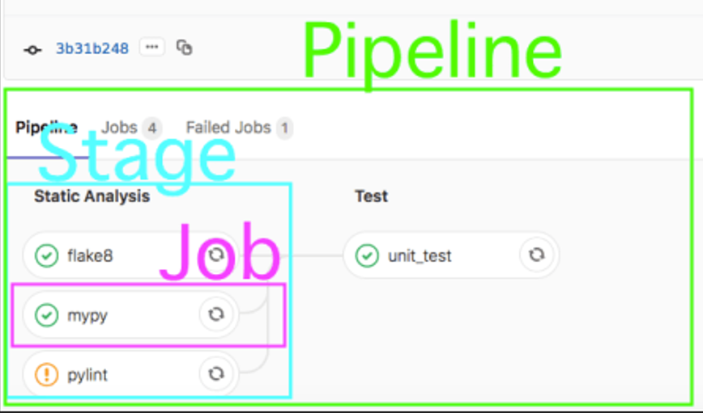

# Навигация

- [Описание](#описание)
- [Соотношение pipeline, stage и job](#соотношение-pipeline-stage-и-job)
- [Пример использования](#пример-использования)
    - [Подключение проекта к SonarQube](#подключение-проекта-к-sonarqube)
    - [Использование в pipeline линтеров для разных языков программирования](#использование-в-pipeline-линтеров-для-разных-языков-программирования)
- [Стандартный шаблон](#стандартный-шаблон)
    - [Правила шаблона](#правила-шаблона)

# Описание

Данный репозиторий содержит `.yml` конфигурации различных линтеров, расчитанные на включение в ваши пайплайны `.gitlab-ci.yml`, с целью добавления стадии статического анализа кода.

# Соотношение pipeline, stage и job



# Пример использования

Добавьте в свой `.gitlab-ci.yml` следующие строки:
```
include:
  - project: <your_project>/ci-linters
    file:
      - .gitlab/flake8.yml
      - .gitlab/mypy.yml
      - .gitlab/pylint.yml
```
Теперь, в вашем `pipeline` доступны автоматические проверки указанными линтерами в соответствии с их конфигурацией в `flake8.yml`, `mypy.yml` и  `pylint.yml`.


## Подключение проекта к SonarQube

SonarQube - это платформа для анализа и измерения качества кода. Подключение Sonar в стадию линтинга выглядит следующим образом:
```
include:
  - project:<your_project>/ci-linters
    file:
      - .gitlab/sonar.yml
```
Далее, необходимо перейти в UI вашего SonarQube интегрированного с Gitlab

- *См. sonar.yml*

и выполнить настройку проекта:

```
Projects >> Create Project >> Gitlab >> *Выбор проекта* >> Set Up >> With Gitlab >> *Выполнить инструкцию*
```
Проверка с помощью `sonar` в пайплайне по правилу запуска является мануальной - это необходимо для запуска только подключенных к `SonarQube` проектов, т.к. при отсутствии подключения запущенная задача будет считаться `failed`

## Использование в pipeline линтеров для разных языков программирования
Если в проекте используется два языка программирования (к примеру, TypeScript и Python), и выхотите выполнять `linting`
для всех используемых языков, то необходимо добавить в данный репозиторий файл с конфигурацией линтеров для вашего языка, и в `.gitlab-ci.yml` указать, например, следующее:
```
include:
  - project: <your_project>/ci-linters
    file:
      - .gitlab/python-linting.yml
      - .gitlab/typescript-linting.yml
```
Таким образом в pipeline можно подключать дополнительные инструменты линтинга для нескольких языков программирования

# Стандартный linting-workflow для Python
Данный шаблон определяет базовые правила, по которым будут выполняться тесты в стадии `linting` в вашем `pipiline`
для проверки Python кода.
```
.workflow:
  stage: linting
  rules:
    - changes:
      - /*.{py}

    - if: $CI_PIPELINE_SOURCE == "merge_request_event" || $CI_COMMIT_BRANCH == $CI_DEFAULT_BRANCH
      when: always
      allow_failure: false

    - if: $CI_COMMIT_BRANCH != $CI_DEFAULT_BRANCH
      when: manual
      allow_failure: true
```

## Правила шаблона
- Название стадии `linting`
- `changes: /*.{py}` - это означает, что стадия linting будет запускаться только при наличии изменений в файлах с расширением .py в любой директории вашего репозитория1.

- `if: $CI_PIPELINE_SOURCE == “merge_request_event” || $CI_COMMIT_BRANCH == $CI_DEFAULT_BRANCH` - это означает, что стадия linting будет запускаться всегда (when: always), если источником пайплайна является событие слияния веток (merge request event) или если ветка коммита совпадает с дефолтной веткой репозитория ($CI_DEFAULT_BRANCH). При этом не допускается неудачное завершение стадии (allow_failure: false)2.

- `if: $CI_COMMIT_BRANCH != $CI_DEFAULT_BRANCH` - это означает, что стадия linting будет запускаться вручную (when: manual), если ветка коммита не совпадает с дефолтной веткой репозитория. При этом допускается неудачное завершение стадии (allow_failure: true)2.
